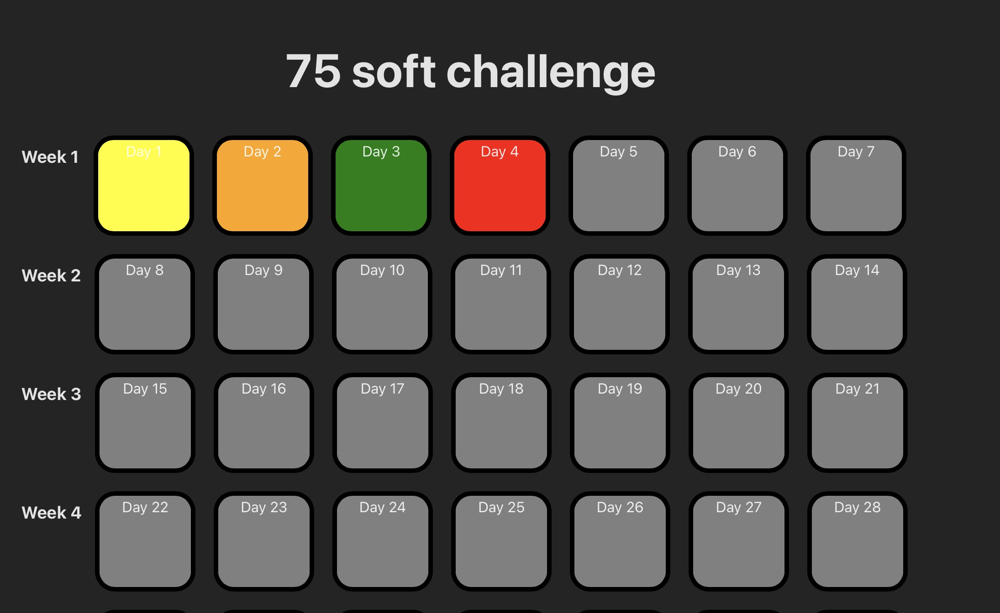

# 75 Soft Challenge

This is a web app I made for fun, for me and my friends to track our achievements as we challenge each other in the 75 Soft Challenge, on which more info can be found [here](https://www.glamourmagazine.co.uk/article/75-soft-challenge-tiktok)

For each day, one checks of the challenges completed that day and depending on how many that are left unchecked each box changes color accordingly.

Future enhancements:
- Implement leader board
- Implement user authentication
- Enable different start dates
- Enable creating new users