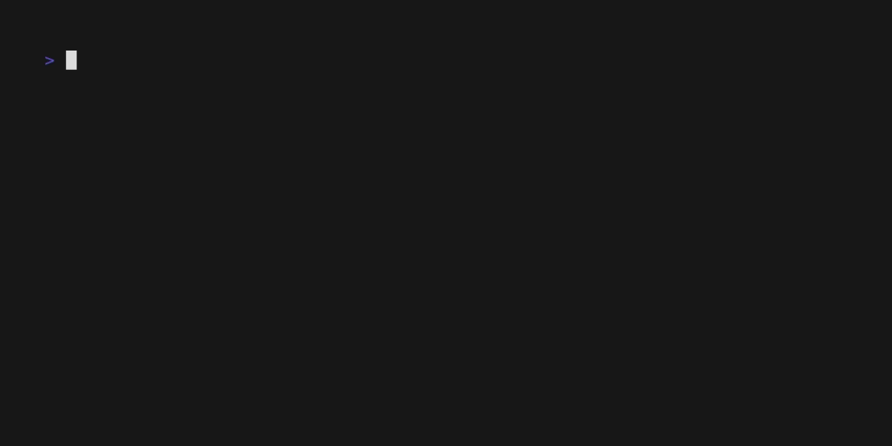

# 75SoftChallenge - Backend

## How to generate/update requirements.txt

Start with creating a virtual environment using below command, assuing you are in `project-root/backend` folder.


```bash
python3 -m venv venv-app
```

Activate the virtual environment.

```bash
source venv-app/bin/activate
```

### Generating requirements.txt file

Install the `pipreqs` by running the below command.

```bash
pip3 install pipreqs
```

And, finally run the below command to generate the `requirements.txt` file.

```bash
pipreqs --ignore venv-app --print
```

## How to start with docker compose

You can simply start the backend with `docker-compose` by running below command.

```bash
docker compose up --build
```



## How to stop docker containers

Press `ctrl+c` to stop the running containers gracefully.
